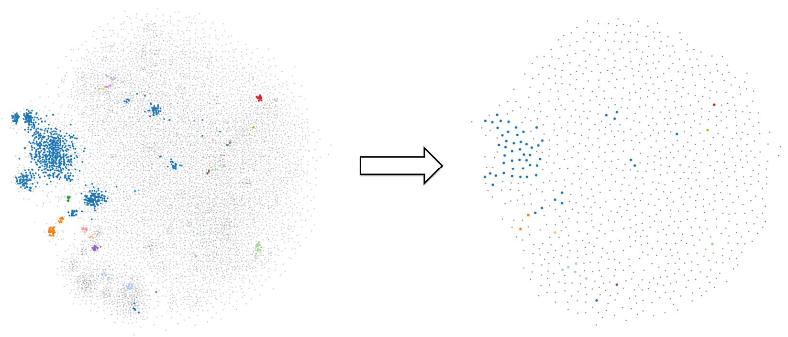

# Diversity Sampling

**TODO**:
- Share the data
- Typing (?)
- Package the code, improve requirements.txt (?)

## Introduction

This repository provides a GPU-compatible implementation of a Coreset sampler.

### Coreset Sampler

> In computational geometry, a coreset is a small set of points that approximates the shape of a larger point set, in the sense that applying some geometric measure to the two sets (such as their minimum bounding box volume) results in approximately equal numbers. 

In our case, we aim at designing an efficient sampler that outputs a diverse and representative subset of our data. The coreset problem is NP-hard therefore we use approximations. 


### Algorithm

For a given dataset $D \in ℝ^{n \times d}$, build a subsample 𝑆 of 𝑚 data points that best represent 𝐷 :
- Initialize 𝑆 with at least one data point 
- While $\text{card}(𝑆)<𝑚$, append to 𝑆 the data point $\hat{𝑥} \in 𝐷$ that is the most diverse to it: 
$$ \hat{𝑥} = \text{argmax}_{𝑥 \in 𝐷} (\lVert 𝑥 − 𝑆  \rVert) $$

Computing the argmax can be slow, to prevent this we leverage two tricks :
- $\lVert 𝑥 − 𝑆  \rVert$ can be computed on GPU
- $\lVert 𝑥 − 𝑆 \rVert$ does not need to be computed for all $𝑠 \in 𝑆$ at every iteration, and leverages that at each iteration, $𝑆 = 𝑆 + \{ \hat{x} \} $

This is leveraged using  $\lVert 𝑥 − 𝑆 \rVert  = \text{min}_{𝑠 \in 𝑆} {\lVert 𝑥 − 𝑠 \rVert}_2$, where ${\lVert 𝑥 − 𝑠 \rVert}_2$ is the euclidian norm :
$$ \text{min}_{𝑠 \in 𝑆} {\lVert 𝑥 − 𝑠 \rVert}_2 = \text{min} \left( \text{min}_{𝑠 \in 𝑆\setminus \{\hat{𝑥}\}} {\lVert 𝑥 − 𝑠 \rVert}_2 , {\lVert 𝑥 − \{\hat{𝑥}\} \rVert} \right) $$
The left element of the min was computed during the previous step of the coreset, hence only the distance to the latest sampled points need to be computed.

### Initialization

One issue with the previous algorithm is that there is no guarantee modes in the distribution are kept. To ensure so, we propose to initialize 𝑆 using one point in each cluster found by DBScan. Motivation behind using DBScan is two-fold : no need to select the number of clusters, and no need to cluster every point. 

**Warning:** DBScan does not scale well, depending on the size of your dataset you may want not to use it. On GPU

### Motivations

Coreset is most useful when you have access to a big dataset with heavy bias, and want to design a diverse subset. The overall idea is that using one point per cluster is most likely enough to represent clusters inside your data, and therefore coreset sampling puts more emphasis on more intersting samples.

- If you want to train a model on a downstream task using a limited number of samples, models will be able to generalize on other points of the clusters easily, whereas outliers will be harder to predict. Overall a train set with huge bias can hinder training.
- If you want to assess performance of a model, a more diverse sampling will ensure higher robustness of your evaluation metrics.


### 


*Applying the coreset algorithm to a set of 2D points where clusters are highlighted in different colors and non-clustered points are in gray.*


## How to use the repository

### Prerequisites
> TODO: share data, specify requirements

- Clone the repository
- Setup the environment: 
  - Requirements: `pip install -r requirements.txt`
  - (Optional): Install [Torch on GPU](https://pytorch.org/get-started/locally/) and [RAPIDS](https://docs.rapids.ai/install) for optimal use of the algorithm!
- To run `Demo_wiki.ipynb`, download the data (TODO: share links)

### Quick start

- Start by loading your embeddings matrix, and then define your sampler and its parameters:
```
from coreset import CoresetSampler

coreset = CoresetSampler(
    n_samples=1000,
    initialization="dbscan",
    dbscan_params={"eps": 0.85, "min_samples": 1000},
)
```

- Run the Coreset sampling:
```
ids = coreset.sample(embeds)
```

Refer to the notebook `Demo_wiki.ipynb` for more details !

### Code structure

If you wish to dive into the code, the repository naming should be straight-forward. Each function is documented.
The structure is the following :

```
src
├── data
├── src                     # Source code
│   ├── coreset.py              # Coreset Sampler
│   └── plot.py                 # Plotting utils
├── notebooks               # Notebooks
│   ├── Demo_wiki.ipynb         # Coreset demo on a wikipedia subset
│   └── ... ?                   # Data processing utls for kaggle
├── .gitignore               
└── README.md
``` 
